# LacVita 💙

Aplicativo Android (Kotlin + Jetpack Compose) desenvolvido para o Challenge — Sprint 3, conectando nutrizes (doadoras de leite humano) a Bancos de Leite Humano (BLH), com base no funcionamento real da Rede Brasileira de Bancos de Leite Humano (rBLH/Fiocruz) e do programa Lactare.

## Equipe

**Nome da equipe:** Codexa

| RM | Integrante |
|---|---|
| 559049 | Anaí Villca Rojas |
| 558820 | Geisa Rodrigues Santos |
| 558864 | Isaque Santana Paixão |
| 555733 | Karla Louise Famula de Melo |
| 558937 | Matheus Soares Pereira |

## Repositório

🔗 https://github.com/KarlaFamula/Challenge-Sprint-3-LACVITA-Android-Kotlin-Developer

## Objetivo do aplicativo

O LacVita conecta **nutrizes** (mães que podem doar leite humano) a **Bancos de Leite Humano**, facilitando todo o fluxo de doação: cadastro, triagem de saúde, agendamento de coleta (em casa ou em um ponto de coleta), acompanhamento do histórico e do impacto das doações, além de um canal de chat com assistente virtual/especialista e conteúdos de apoio (FAQ e Central de Saúde). O app busca reduzir a burocracia e a insegurança de quem quer doar leite pela primeira vez, guiando a doadora do zero até a doação concluída.

## Funcionalidades implementadas nesta Sprint

Todas as funcionalidades abaixo estão implementadas com **dados mockados** (sem API, Firebase ou banco de dados), simulando o comportamento real do produto:

- **Onboarding** explicativo (o que é o LacVita, como funciona, se a usuária já participa do Conecta BLH ou é nova)
- **Login / Criar conta**
- **Cadastro de dados pessoais** (é mãe, está amamentando)
- **Triagem de saúde** (perguntas de elegibilidade para doação)
- **Próximos passos** (checklist de preparo para a coleta)
- **Home** com resumo da doadora (litros doados, bebês alimentados, próxima coleta agendada, dica de saúde, atalhos para Central de Saúde e FAQ)
- **Mapa/lista de pontos de coleta (BLHs)** com distância, horário de funcionamento e vagas do dia
- **Detalhe de um BLH** (navegação por parâmetro a partir da lista)
- **Agendamento de coleta**, com escolha entre coleta em casa ou levar a um ponto, data e hora
- **Chat** com abas Assistente/Especialista e perguntas rápidas
- **Central de Saúde** e **FAQ**
- **Notificações**
- **Meu impacto**, com total doado e ranking de litros coletados por polo/estado
- **Histórico de doações** em formato de calendário mensal
- **Meu perfil**, com dados da nutriz, endereços salvos, configurações e logout

### Priorização

O grupo priorizou o fluxo completo de uma doadora **nova**: da descoberta do app (onboarding) até o agendamento e acompanhamento da doação (home, coletas, impacto, histórico), pois é esse fluxo que demonstra o valor central da proposta apresentada no pitch — reduzir a fricção entre quem tem leite excedente e os bancos de leite que precisam dele. Chat, FAQ e Central de Saúde foram incluídos como suporte a esse fluxo principal, reforçando a confiança da doadora no processo.

## Telas do aplicativo

| Tela | Descrição |
|---|---|
| 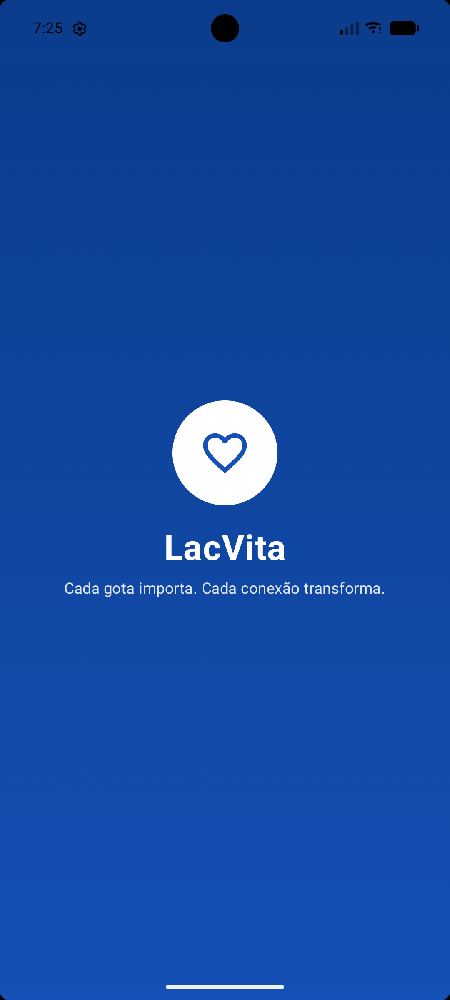 | **Splash** — tela de abertura com a marca LacVita. |
| 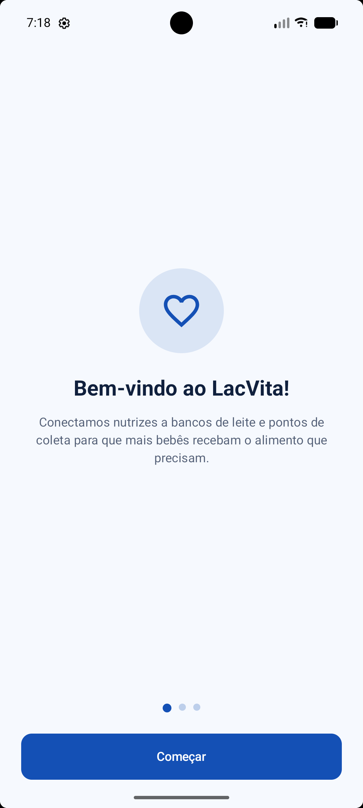 | **Onboarding — Boas-vindas** — apresenta o propósito do app. |
| 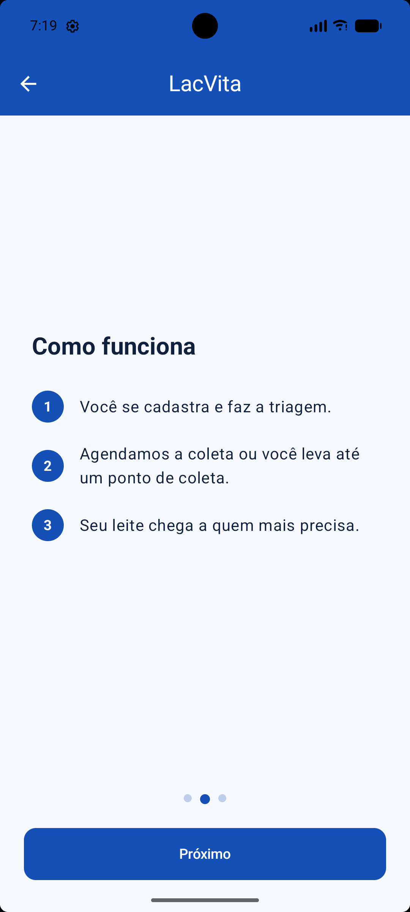 | **Onboarding — Como funciona** — explica os 3 passos (cadastro/triagem, agendamento da coleta, entrega ao ponto). |
| 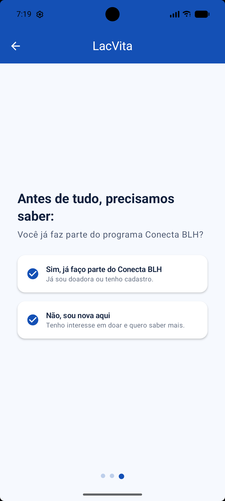 | **Onboarding — Conecta BLH** — pergunta se a usuária já participa do programa ou é nova. |
| 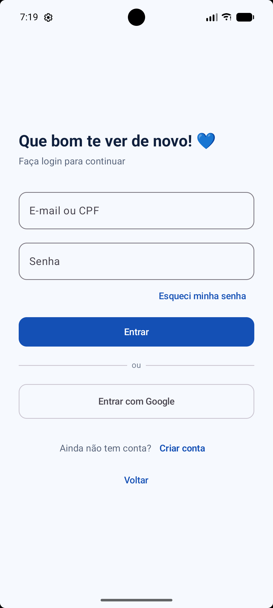 | **Login** — autenticação por e-mail/CPF e senha, ou criação de conta. |
| 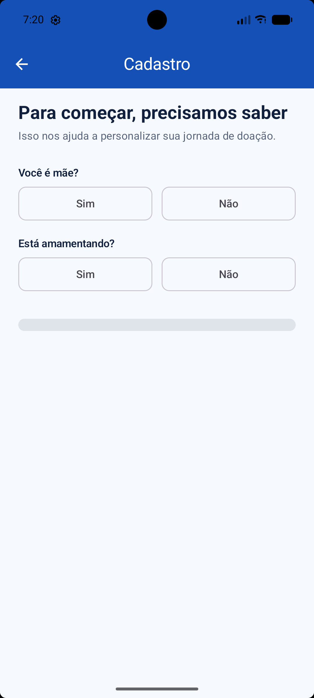 | **Cadastro de dados pessoais** — perguntas iniciais (é mãe, está amamentando). |
| 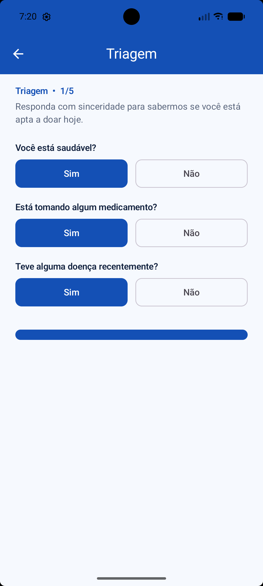 | **Triagem** — questionário de saúde para elegibilidade de doação. |
| 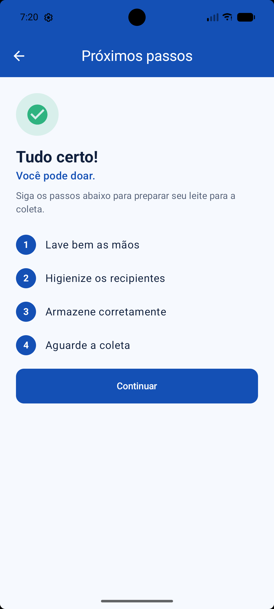 | **Próximos passos** — checklist de preparo antes da coleta. |
| 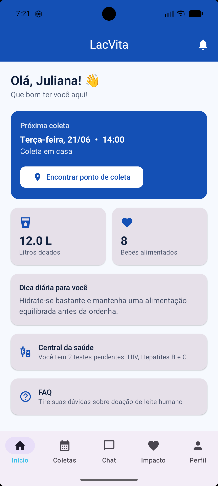 | **Home** — resumo da doadora, próxima coleta, litros doados e atalhos. |
| 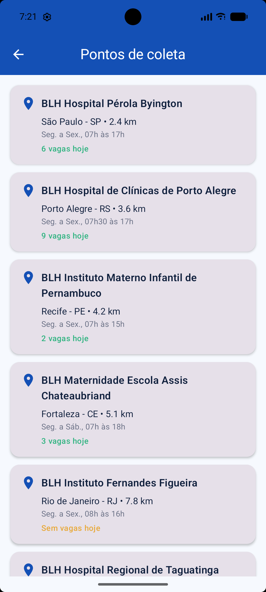 | **Pontos de coleta** — lista de BLHs com distância e vagas do dia. |
| 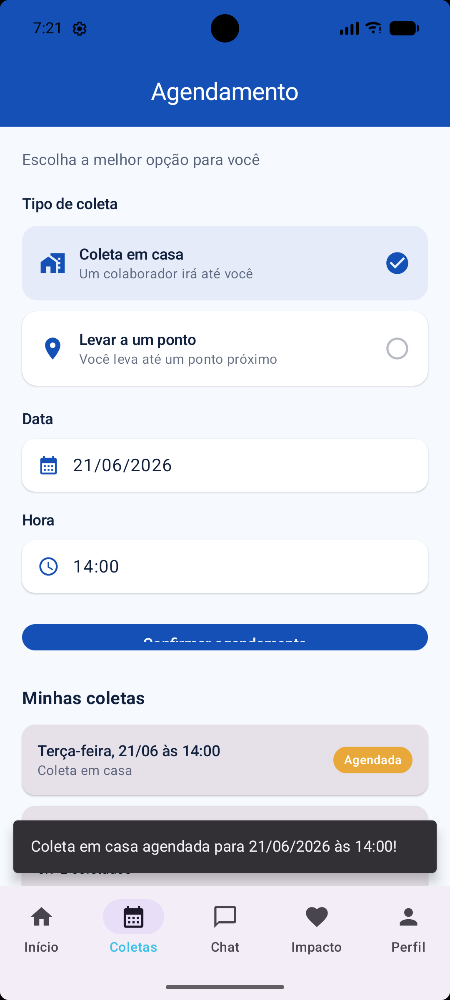 | **Agendamento** — escolha entre coleta em casa ou em ponto, data e hora. |
| 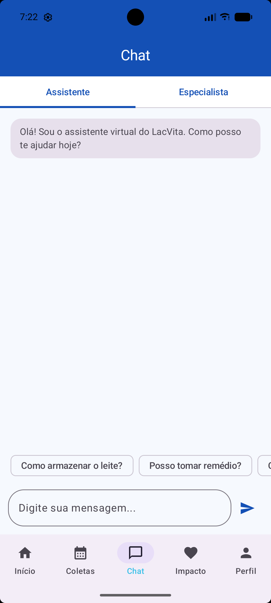 | **Chat** — assistente virtual e especialista, com perguntas rápidas. |
| 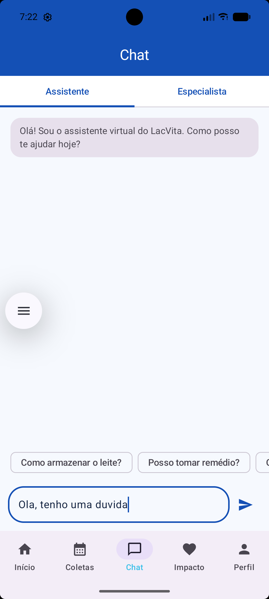 | **Chat — conversa** — envio de mensagem no chat. |
| 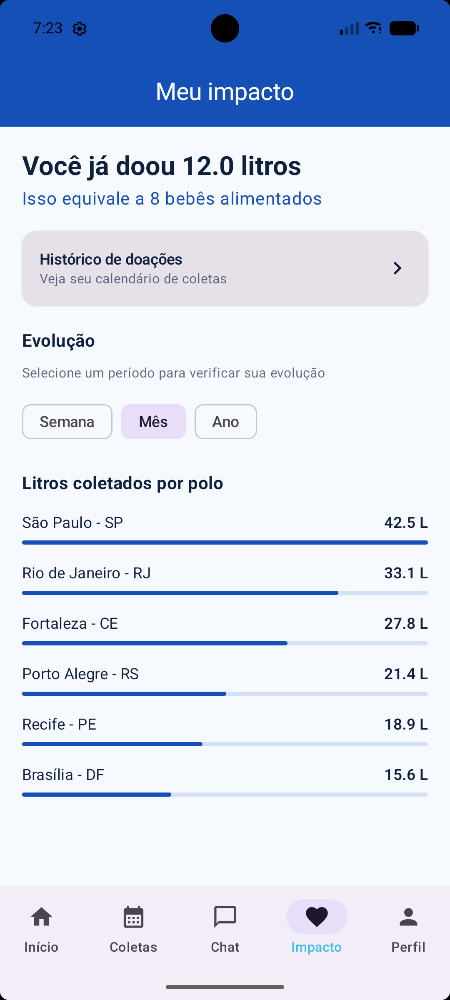 | **Meu impacto** — total doado, evolução e ranking por estado. |
| 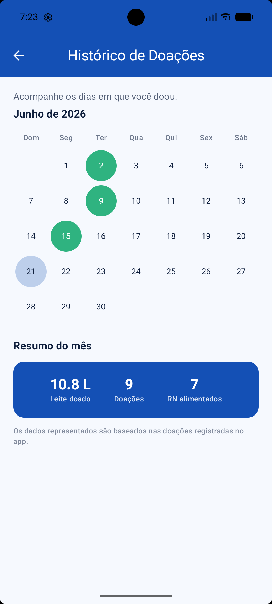 | **Histórico de doações** — calendário mensal com resumo do mês. |
| 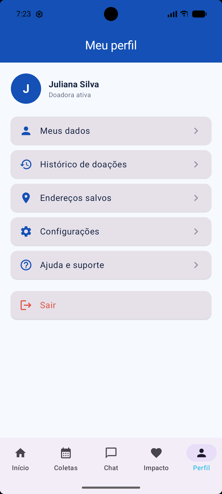 | **Meu perfil** — dados da nutriz, endereços, configurações e logout. |

> As imagens acima foram capturadas rodando o aplicativo no emulador/dispositivo Android.

## Dados mockados

Todos os dados simulados ficam centralizados em `mock/MockDataProvider.kt`, separados dos dados soltos nas telas, e representam cenários realistas (nomes de hospitais reais de BLHs, endereços, litros doados, datas de coleta etc.), sem uso de "Item 1", "Teste" ou "Lorem ipsum". Os modelos de dados (`model/`) incluem: `Blh`, `ColetaAgendada`, `DiaDoacao`, `Exame`, `FaqItem`, `Notificacao`, `Nutriz`, `PoloComunidade`, `RequisitoDoacao` e os modelos de chat (`ChatModels.kt`).

## Arquitetura e organização do código

```
app/src/main/java/.../lacvita/
├── mock/          → fonte única de dados mockados (MockDataProvider)
├── model/         → classes de dados (Blh, Nutriz, ColetaAgendada, etc.)
├── navigation/     → rotas (LacVitaDestinations) e grafo de navegação (LacVitaNavGraph)
├── ui/
│   ├── components/ → componentes reutilizáveis (TopBar, BottomBar, chips, seletores)
│   ├── screens/    → uma pasta por tela/fluxo (home, login, cadastro, triagem, coletas,
│   │                 mapa, chat, impacto, historico, perfil, faq, notificacoes, etc.)
│   └── theme/      → cores, tipografia e tema Material 3
└── MainActivity.kt → ponto de entrada, hospeda o NavHost
```

## Navegação

A navegação usa **Jetpack Navigation Compose** (`navigation-compose`), com:
- Fluxo linear de entrada: Splash → Onboarding → Login/Cadastro → Triagem → Próximos passos → Home;
- 5 abas principais com bottom navigation (Início, Coletas, Chat, Impacto, Perfil);
- Passagem de parâmetro na navegação da lista de pontos de coleta para o detalhe do BLH (`detalheBlh/{blhId}`);
- Telas secundárias (Notificações, FAQ, Central de Saúde, Histórico) acessadas a partir da Home/Perfil/Impacto, com retorno via botão de voltar.

## Tecnologias utilizadas

- Kotlin
- Jetpack Compose + Material 3
- Navigation Compose (`androidx.navigation:navigation-compose`)
- Material Icons Extended
- Android Studio (compileSdk 36, minSdk 24, targetSdk 36)

## Como executar o projeto

1. Abra o Android Studio (recomendado: **versão 2024.x / Ladybug ou superior**, com Gradle/AGP compatíveis com compileSdk 36).
2. Clone o repositório ou baixe o `.zip` e abra a pasta raiz do projeto no Android Studio (`File > Open`).
3. Aguarde a sincronização automática do Gradle (as dependências estão declaradas em `app/build.gradle.kts`).
4. Selecione um emulador (API 24+) ou conecte um dispositivo físico.
5. Clique em **Run ▶** (ou `Shift + F10`) para instalar e executar o app.

Não é necessária nenhuma configuração adicional (chaves de API, Firebase, etc.), pois todos os dados são mockados nesta Sprint.

## Escopo desta Sprint

Conforme definido no enunciado, **não há integração com API, Firebase, banco de dados local ou backend** nesta entrega. Todos os fluxos são simulados com dados mockados organizados em código, representando o comportamento esperado da solução.
